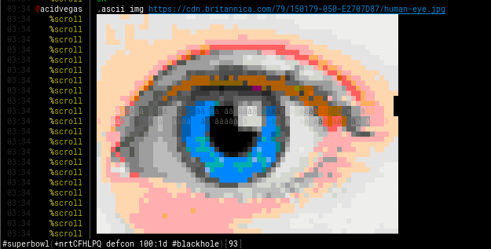

# scroll

Scroll is full-featured IRC bot that carries a **PENIS PUMP** & will brighten up all the mundane chats in your lame IRC channels with some colorful IRC artwork! Designed to be extremely stable, this bot is sure to stay rock hard & handle itself quite well!

All of the IRC art is loaded directly from the [ircart](https://github.com/ircart/ircart) central repository using the [Github API](https://docs.github.com/en/rest), which means that anytime the repository is updated with new art, you can simply `.ascii sync` & then be able to pump the latest art packs!

Designed to be portable, there is no API key needed, no local art files needed, & no reason to not setup scroll in your channel(s) today!

## Dependencies
* [python](https://www.python.org/)
* [chardet](https://pypi.org/project/chardet/) *(`pip install chardet`)*
* [numpy](https://pypi.org/project/numpy/) *(`pip install numpy`)*
* [opencv-python](https://pypi.org/project/opencv-python/) *(`pip install opencv-python`)*

## Commands
| Command                                | Description                                                |
| -------------------------------------- | ---------------------------------------------------------- |
| `@scroll`                              | information about scroll                                   |
| `.ascii <name>`                        | play the \<name> art file                                  |
| `.ascii dirs`                          | list of art directories                                    |
| `.ascii img <ur>`                      | convert image \<ur> to art *(experimental, beta status)*   |
| `.ascii list`                          | list of art filenames                                      |
| `.ascii play <url>`                    | play the contents of \<url> *(must be a raw pastebin url)* |
| `.ascii random [dir|query]`            | play random art, optionally from a [dir] or [query]        |
| `.ascii search <query>`                | search art files that match \<query>                       |
| `.ascii settings [<setting> <option>]` | view or change settings                                    |
| `.ascii stop`                          | stop playing art                                           |
| `.ascii sync`                          | sync the ascii database to pump the newest art             |

**NOTE**: You can do `.ascii help` to play the [help.txt](https://github.com/ircart/ircart/blob/master/ircart/doc/help.txt) file in your channel.

**NOTE**: The sync & settings commands are admin only! `admin` is a *nick!user@host* mask defined in [scroll.py](https://github.com/ircart/scroll/blob/master/scroll.py)

## Settings
| Setting               | Type         | Description                                                                                  |
| --------------------- | ------------ | -------------------------------------------------------------------------------------------- |
| `flood`               | int or float | delay between each command                                                                   |
| `ignore`              | str          | directories to ignore in `.ascii random` *(comma seperated list, no spaces)*                 |
| `lines`               | int          | max lines outside of #scroll                                                                 |
| `msg`                 | int or float | delay between each message sent                                                              |
| `paste`               | boolean      | enable or disable `.ascii play`                                                              |
| `png_quantize_colors` | int          | quantize color option for `.ascii img` output                                                |
| `png_palette`         | str          | palette option for `.ascii img` output *(RGB99 or RGB88)*                                    |
| `png_width`           | int          | maximum width for `.ascii img` output                                                        |
| `results`             | int          | max results to return in `.ascii search`                                                     |

## Preview

Come pump with us in **#scroll** on [irc.supernets.org](ircs://irc.supernets.org)

___

###### Mirrors
[acid.vegas](https://git.acid.vegas/scroll) • [GitHub](https://github.com/ircart/scroll) • [GitLab](https://gitlab.com/ircart/scroll) • [SuperNETs](https://git.supernets.org/ircart/scroll)
