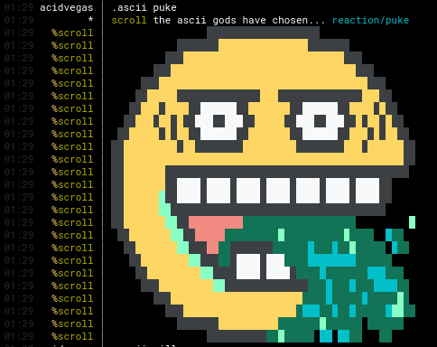

# scroll

Scroll is full-featured IRC bot that carries a **PENIS PUMP** & will brighten up all the mundane chats in your lame IRC channels with some colorful IRC artwork! Designed to be extremely stable, this bot is sure to stay rock hard & handle itself quite well!

All of the IRC art is loaded directly from the [ircart](https://github.com/ircart/ircart) repository, which means anytime that the repository is updated with new art, you can simply `.ascii sync` & then be able to pump the latest art packs!

## Dependencies
* [python](https://www.python.org/)
* [chardet](https://pypi.org/project/chardet/) *(`pip install chardet`)*

## Commands
| Command                  | Description                                               |
| ------------------------ | --------------------------------------------------------- |
| `@scroll`                | information about scroll                                  |
| `.ascii <name>`          | play the \<name> art file                                 |
| `.ascii dirs`            | list of art directories                                   |
| `.ascii list`            | list of art filenames                                     |
| `.ascii random [dir]`    | play random art, optionally from the [dir] directory only |
| `.ascii search <query>`  | search for art diles that match \<query>                  |
| `.ascii stop`            | stop playing art                                          |
| `.ascii sync`            | sync the ascii database to pump the newest art            |

## Preview

Come pump with us in **#scroll** on [irc.supernets.org](ircs://irc.supernets.org)

## Mirrors
- [acid.vegas](https://git.acid.vegas/scroll)
- [GitHub](https://github.com/ircart/scroll)
- [GitLab](https://gitlab.com/ircart/scroll)
- [SuperNETs](https://git.supernets.org/ircart/scroll)