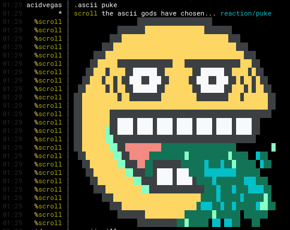
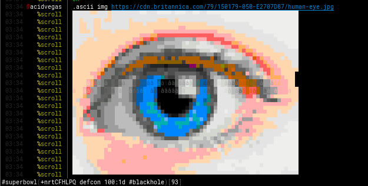

# scroll

Scroll is full-featured IRC bot that carries a **PENIS PUMP** & will brighten up all the mundane chats in your lame IRC channels with some colorful IRC artwork! Designed to be extremely stable, this bot is sure to stay rock hard & handle itself quite well!

All of the IRC art is loaded directly from the [ircart](https://git.supernets.org/ircart/ircart) central repository, which means that anytime the repository is updated with new art, you can simply `.ascii sync` & then be able to pump the latest art packs!

Designed to be portable, there is no API key needed, no local art files needed, & no reason to not setup scroll in your channel(s) today!

## Dependencies
* [python](https://www.python.org/)
* [aiohttp](https://pypi.org/project/aiohttp/) *(`pip install aiohttp`)*
* [chardet](https://pypi.org/project/chardet/) *(`pip install chardet`)*
* [Pillow](https://pypi.org/project/Pillow/) *(`pip install Pillow`)*
* [img2irc](https://github.com/waveplate/img2irc) *(patched build, see below)*

## Commands
| Command                                | Description                                                |
| -------------------------------------- | ---------------------------------------------------------- |
| `@scroll`                              | information about scroll                                   |
| `.ascii [dir/]<name>`                  | play the \<name> art file, optionally from a [dir]         |
| `.ascii dirs`                          | list of art directories                                    |
| `.ascii dupe [name]`                   | play every copy of the next unflagged duplicate name       |
| `.ascii flag <name> <reason>`          | flag bad art for review *(saved to flagged.txt)*           |
| `.ascii help [img]`                    | list of commands, or every `.ascii img` option             |
| `.ascii img <url> [options]`           | convert an image to art *(png, jpeg, gif, webp)*           |
| `.ascii list`                          | list of art filenames                                      |
| `.ascii random [dir\|query]`           | play random art, optionally from a [dir] or [query]        |
| `.ascii search <query>`                | search art files that match \<query>                       |
| `.ascii settings [<setting> <option>]` | view or change settings                                    |
| `.ascii stop`                          | stop playing art                                           |
| `.ascii sync`                          | sync the ascii database to pump the newest art             |

**NOTE**: The flag, sync & settings commands are admin only! `admin` is a *nick!user@host* mask defined in [scroll.py](https://git.supernets.org/ircart/scroll/src/branch/master/scroll.py)

## Settings
| Setting               | Type         | Description                                                                                  |
| --------------------- | ------------ | -------------------------------------------------------------------------------------------- |
| `flood`               | int or float | delay between each command                                                                   |
| `ignore`              | str          | directories to ignore in `.ascii random` *(comma seperated list, no spaces)*                 |
| `imgflood`            | int or float | delay between each `.ascii img` command                                                      |
| `linelen`             | int          | server line limit in bytes, including the trailing `\r\n` *(art lines are trimmed to fit)*   |
| `lines`               | int          | max lines outside of #scroll                                                                 |
| `msg`                 | int or float | delay between each message sent                                                              |
| `results`             | int          | max results to return in `.ascii search`                                                     |

## img2irc
`.ascii img` accepts any [img2irc](https://github.com/waveplate/img2irc) option except `--render` *(always `irc`)* & `--scale`. The width defaults to & is capped at 80 columns *(it shrinks automatically when a line would not fit the server line limit)* & the height is capped at the `lines` setting. Images are downloaded by scroll *(public addresses only, max 10 MB & 4096x4096)* & validated with Pillow before img2irc ever sees them.

img2irc is built from commit `ec62c7f` with [img2irc.patch](img2irc.patch), which removes its own url fetching *(reqwest, tokio, url, openssl)*, the unused atty crate & the wasm features of photon-rs:

```shell
git clone https://github.com/waveplate/img2irc && cd img2irc
git checkout ec62c7f168a3da1ca1aec2676ec27b825e731bd0
git apply ../img2irc.patch
cargo generate-lockfile && cargo audit
cargo install --path . --locked
```

## Preview





Come pump with us in **#scroll** on [irc.supernets.org](ircs://irc.supernets.org)

___

###### Mirrors: [SuperNETs](https://git.supernets.org/ircart/scroll) • [GitHub](https://github.com/ircart/scroll) • [GitLab](https://gitlab.com/ircart/scroll) • [Codeberg](https://codeberg.org/ircart/scroll)
